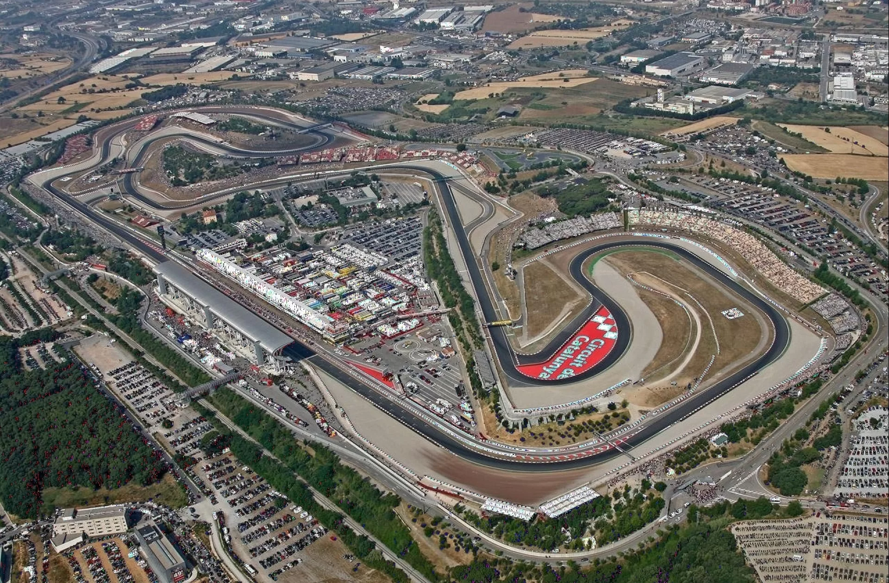
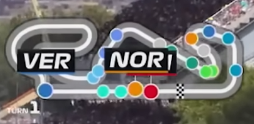
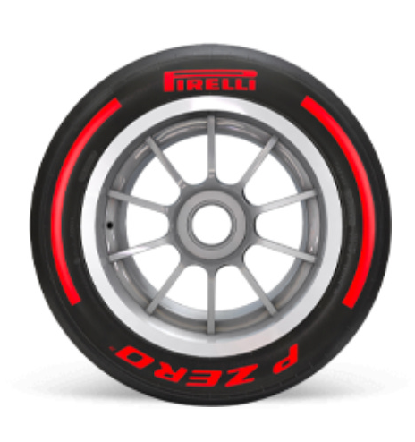
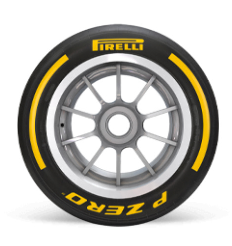
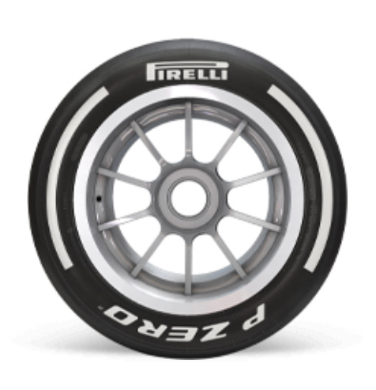

#  Projeto de Sistemas de Redes para Jogos
## Used Git Repo: https://github.com/TomasCardoso46/R.O.S

## Author

### Tomás Ricardo Branco Cardoso a22303462

## Premissa do jogo
É um jogo de corrida onde cada jogador está encarregue de gerir a estratégia do seu piloto.
Dois jogadores competem para ganhar uma corrida de 50 voltas pelo Circuito de Catalunha/Barcelona, usado por campeonatos como F1 e MotoGP.
(O jogo pode receber até 4 jogadores para teste, mas o jogo é feito para 2, apesar de poder ser extendido com poucas mudanças)

A gameplay durante corridas é semelhante a jogos como F1 Manager, F1 Clash e Motorsport Manager.

Os carros começam parados na reta principal, estando o host em primeiro lugar, após ambos os jogadores estarem conectados começa a corrida, com ambos os jogadores nos pneus meédios.
Ao começarem nos mesmos pneus, os jogadores começam também com a mesma velocidade.
A velocidade vai diminuindo a cada checkpoint passado, pelo que jogadores devem trocar de pneus para obter um tempo final mais rápido que o seu adversário.
Jogadores também têm a opção de dar "Push", isto aumenta a sua velocidade nas curvas, mas aumenta também a velocidade perdida por checkpoint.

Os Jogadores não sabem se o outro vai parar nesta volta até a troca de pneus começar, pelo que estar em segundo lugar pode oferecer uma vantagem estratégica a nivel de informação obtida.

## Como jogar

Jogadores clicam num dos inputs de pneus para planear uma pit stop, esta será executada no fim da volta.
Os Inputs de pneus são:
S - Softs
M - Mediums
H - Hards

Jogadores podem também clicar no P para ativar e desativar o modo "Push".

## Como funciona a simulação
Os carros, são bolas coloridas, inspiradas pelos verdadeiros icones usados pela transmissão oficial de F1 quando o traçado da pista é mostrado.

Estes têm uma variavel de velocidade pura e uma de degradação dos pneus, que juntas resultam na verdadeira velocidade.
Nas curvas a velocidade pura é diminuida, este efeito é reduzido quando o jogador está no modo "Push".

Existem três pneus, Softs, Mediums e Hards.

Softs - Velocidade pura maior, Degradação maior.

Mediums - Velocidade pura normal, Degradação normal.

Hards - Velocidade pura menor, Degradação menor

A degradação é aplicada a cada checkpoint, logo, partes da pista com mais curvas, ou curvas mais longas, degradam mais os pneus.
Um jogador que está a usar os Softs, será inicialmente o mais rápido, mas se não trocar de pneus mais cedo irá ser mais lento que os restantes

Durante as trocas de pneus, os jogadores ficam parados por 5 segundos, sendo essencial coordenar as trocas, de modo a que o beneficio da troca de pneus seja superior aos 5 segundos da paragem, pelo menos até
à próxima troca.

Usar o modo "Push", aumenta a degradação, pelo que não deve estar sempre ativo, especialmente nos Softs.

## Funcionalidade Online
Os jogadores começam uma sessão clicando no botão "Host", isto gera e mostra um código, que deverá ser passado a quem se quiser juntar.
Clientes devem introduzir o código na caixa de texto e clicar no "Join" para se juntarem à sessão do jogador que produzio o código.

O jogo usa Relay do unity, disponivel em "cloud.unity.com".

Os vários componentes usam o Netcode for GameObjects do unity

As variáveis que diretamente impactam a visão do jogo ou velocidades, raceLap, tireLap, pitRequested, tireType, isPushing são sincronizadas apenas com o uso de NetworkVariable< T >.

Inputs passam por um ServerRpc enquanto estado de vitória passa pelo ClientRpc.

Metodo SpawnCarForClient instancia o carro do novo jogador tanto para o novo jogador como para o Host, assim seria possivel hipoteticamente extender o jogo para ter mais jogadores

No script de relay, é feito um login anonimo e conexão aos serviços Unity, CreateRelay solicita uma alocação de servidor Relay, o transporte segue o protocolo DTLS, Apenas após isto começa a sessão.

Diagrama de Arquitetura de Redes:
graph TD
[Cliente 1]       [Cliente 2]
     |                 |
     |                 |
     v                 v
[Servidor Relay da Unity]
           |
           v
        [Host]

## Webgrafia
https://youtu.be/HWPKlpeZUjM?si=X6M31Svnu8Lcc2_s - Tutorial de Netcode for GameObjects

https://youtu.be/msPNJ2cxWfw?si=SOKyX9Hld-GtDjW2 - Tutorial de Relay

https://youtu.be/fRJlb4t_TXc?si=uwFQBfekkcQb8tIs - Tutorial de Relay, a maior parte do relay vem deste video, com algumas correções devido a mudanças da API.

### Movement
For this simulation we use cinematic movement, as the agents simply "slide" over the navmesh surface.

Grey areas are walkable paths, agents can also walk inside restaurants and green areas, but will try to stick to the grey areas. This was achieved by simply giving a higher cost to the other areas inside the Navigation tab of unity's navmesh.

### Crowd Management

#### Seats
For the restaurant, since it was necessary for it to have usable seats, we made two scripts to accommodate this. The first script, "SeatManager.cs", placed inside a single empty game object, receives a list of all available seats for a given area and selects any available seat in a given area. The script is able to tell where each seat belongs through its groupID.
The groupID allows us to have as many seating areas as we can without creating more lists. For example, if we have two restaurants, the seats from restaurant 1 can have groupID = 1, so when the agent looks for an available seat at restaurant 1, it only takes into account seats with a groupID = 1.
This also means the seats are not actually associated to the restaurant itself, so if they were to be moved they would still be available, this makes it easier to implement in other scenes or projects.
If an agent is moving towards a seat, it becomes reserved and no other agent can take it. When the agent reaches its seat, it becomes occupied, which when actions such as eating and resting start.

The second script is simply titled "Seat.cs", and its placed inside the seat prefab. This script is very small and just tells the Seat Manager its groupID, and its availability.

These scripts were later also used for the stages and green areas.
For the stages, invisible seats are placed in rows, which when placed inside the Seat Manager also makes sure agents try to go as close to the stages as possible.

#### Green areas
For the green areas, an addon had to be made. So far, all uses of seats require them to be placed manually, but this would not work for the green area's rules, as its required that agents try and sit as far away from others as possible.
"TemporarySeatController" instanciates seats inside the green area as far away as possible from each other, these sits disappear after the agents leave them and are no longer accounted for when a new seat is instanciated.
The first seat just spawns in a random position inside the area.
These temporary seats are still managed by the original Seat Manager, simply having a different groupID.

### Explosions
The explosions are a simple prefab containing three circles with different colors.
Agents react to the explosions when they first enter their triggers.

Users can spawn explosions by clicking anywhere on the map by using a ScreenPointToRay from the camera.

### Fires
Fires spawn inside the explosion's death zones, these will keep spreading at a customizable speed, killing every agent that they collide with.

### Deaths
When an agent dies, the number of deaths shown on screen increases, be it from the explosions or the fires.
After being counted, agents are destroyed.

### Agent AI

#### FSM

In the FSM, we used scriptable objects that contained the FSM states. These states have actions that are called while in that state, and transitions that change the agent's state, depending on conditions.
All numeric variables, except for the value by which the speed is multiplied, which was specifically asked to either double or halve, can be changed in the agent prefab. It is also possible to change the seat and exit IDs, and the exits can accept multiple ones, as long as there is at least one.

#### Decision Tree

Introduction

The decision tree is composed of three main classes that collaborate to create and execute decisions hierarchically. Each decision is evaluated dynamically during runtime (update).

Classes

IDecisionTreeNode:

It is the base interface for all nodes in the decision tree that defines that any node (decision or action) must implement the MakeDecision() method. This method executes the logic associated with the node and returns the next IDecisionTreeNode, allowing navigation through the tree.

DecisionNode:

Represents a decision node in the tree, capable of choosing between two paths (trueNode or falseNode) through a boolean condition. It evaluates a function (Func<bool>) to decide which node to follow (true or false) and then forwards the execution to the next appropriate node, recursively calling MakeDecision on the next node.

ActionNode:

Represents an action node, or a leaf in the decision tree, which executes a method (Action) associated with a specific action. The Execute() method directly performs the action associated with it and returns itself because actions don't have subsequent decisions.

## Results
We found the FSM easier to make at start, but mixing of multiple states, like being in panic and being paralyzed created some issues that had to be solved in a way that was a bit more hard coded than we would have liked.
For the Decision Tree, it took longer to get it to work, but it came with less issues, other than it constantly trying to change its current action, which was promply solved.

Overall both were good, if the project were to be expanded we would either use a mix of both or stick to Decision Trees.

## Conclusion

This project successfully simulated agents in a concert environment, where they had to move between stages, eat, and rest. We used both Decision Trees and State Machines to create two versions of the simulation, each with its own strengths in how agents make decisions.

The seating system for restaurants, stages, and green areas allowed agents to find and occupy seats based on their needs. The explosion and panic systems simulated a bombing, as agents had to react to the dangerous situation by running away or helping to spread panic.

The agents moved smoothly over the environment using cinematic movement on the NavMesh.

Overall, the project created a believable concert bombing simulation. The different systems we built, such as crowd management and agent behavior, worked well together.
