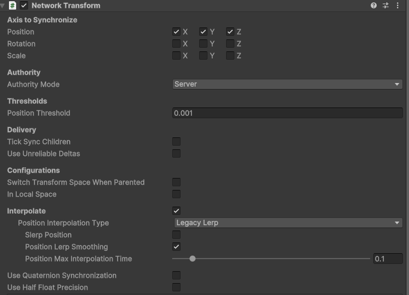

#  Projeto de Sistemas de Redes para Jogos
## Used Git Repo: https://github.com/TomasCardoso46/R.O.S

## Author

### Tomás Ricardo Branco Cardoso a22303462


## Premissa do jogo
É um jogo de corrida onde cada jogador está encarregue de gerir a estratégia do seu piloto.
Dois jogadores competem para ganhar uma corrida de 50 voltas pelo Circuito de Catalunha/Barcelona, usado por campeonatos como F1 e MotoGP.
(O jogo pode receber até 4 jogadores para teste, mas o jogo é feito para 2, apesar de poder ser extendido com poucas mudanças)


A gameplay durante corridas é semelhante a jogos como F1 Manager, F1 Clash e Motorsport Manager.

Os carros começam parados na reta principal, estando o host em primeiro lugar, após ambos os jogadores estarem conectados começa a corrida, com ambos os jogadores nos pneus meédios.
Ao começarem nos mesmos pneus, os jogadores começam também com a mesma velocidade.
A velocidade vai diminuindo a cada checkpoint passado, pelo que jogadores devem trocar de pneus para obter um tempo final mais rápido que o seu adversário.
Jogadores também têm a opção de dar "Push", isto aumenta a sua velocidade nas curvas, mas aumenta também a velocidade perdida por checkpoint.

Os Jogadores não sabem se o outro vai parar nesta volta até a troca de pneus começar, pelo que estar em segundo lugar pode oferecer uma vantagem estratégica a nivel de informação obtida.

## Como jogar

Jogadores clicam num dos inputs de pneus para planear uma pit stop, esta será executada no fim da volta.
Os Inputs de pneus são:
S - Softs
M - Mediums
H - Hards

Jogadores podem também clicar no P para ativar e desativar o modo "Push".

## Como funciona a simulação
Os carros, são bolas coloridas, inspiradas pelos verdadeiros icones usados pela transmissão oficial de F1 quando o traçado da pista é mostrado.


Estes têm uma variavel de velocidade pura e uma de degradação dos pneus, que juntas resultam na verdadeira velocidade.
Nas curvas a velocidade pura é diminuida, este efeito é reduzido quando o jogador está no modo "Push".

Existem três pneus, Softs, Mediums e Hards.

Softs - Velocidade pura maior, Degradação maior.


Mediums - Velocidade pura normal, Degradação normal.


Hards - Velocidade pura menor, Degradação menor


A degradação é aplicada a cada checkpoint, logo, partes da pista com mais curvas, ou curvas mais longas, degradam mais os pneus.
Um jogador que está a usar os Softs, será inicialmente o mais rápido, mas se não trocar de pneus mais cedo irá ser mais lento que os restantes

Durante as trocas de pneus, os jogadores ficam parados por 5 segundos, sendo essencial coordenar as trocas, de modo a que o beneficio da troca de pneus seja superior aos 5 segundos da paragem, pelo menos até
à próxima troca.

Usar o modo "Push", aumenta a degradação, pelo que não deve estar sempre ativo, especialmente nos Softs.


## Funcionalidade Online
Processo de iniciar uma sessão:
1. O host faz login anónimo nos serviços Unity.
2. Um Allocation é criado via RelayService.CreateAllocationAsync.
3. Um código de entrada é gerado GetJoinCodeAsync.
4. O host define os dados de transporte DTLS SetRelayServerData.
5. A sessão começa com NetworkManager.StartHost().
6. Clientes entram com o código, fazendo então JoinAllocationAsync, seguido de StartClient().


O jogo usa Relay do unity, disponivel em "cloud.unity.com".

O código é gerado pelo próprio serviço de relay do unity.

O Movimento dos carros é controlado por cada client no script PathFollower.cs.

Todas as instâncias de carros têm um Network Transform que é responsável por sincronizar apenas as posições, em X, Y e Z.
Não é necessário sincronizar as rotações, visto que os carros são apenas circulos.

Todos os inputs são feitos localmente se o carro pertencer ao cliente.
Os inputs são validados pelo servidor, mas estados do carro não têm qualquer tipo de proteção.
Na visão do dono do carro, os seus estados são alterados, mas na visão de quem não é dono do carro apenas o movimento é alterado, que já estava sincronizado pelo Network Transform
O Server sabe quando qualquer jogador quer trocar de pneus ou dar push, mas o cliente que não é dono do carro nem recebe essa informação, apenas vê os acontecimentos.



Inputs passam por um ServerRpc enquanto estado de vitória passa pelo ClientRpc.

As variáveis que diretamente impactam a visão do jogo ou velocidades, raceLap, tireLap, pitRequested, tireType, isPushing são sincronizadas apenas com o uso de NetworkVariable< T >.

Nesta versão do jogo, os textos relacionados aos estados do jogo de ambos os jogadores existem ao mesmo tempo nos dois clientes, sendo cada cliente apenas responsável por dar display ao UI do seu carro, verificando a ownership do mesmo.

Metodo SpawnCarForClient instancia o carro do novo jogador tanto para o novo jogador como para o Host, assim seria possivel hipoteticamente extender o jogo para ter mais jogadores, seria ainda necessário alterar a maneira como a UI do jogo funciona.

No script de relay, é feito um login anonimo e conexão aos serviços Unity, CreateRelay solicita uma alocação de servidor Relay, o transporte segue o protocolo DTLS, Apenas após isto começa a sessão.


Diagrama de Arquitetura de Redes:
```
              +----------------+
              |  Unity Relay   |
              |   (DTLS/UDP)   |
              +--------+-------+
                       |
           +-----------+-----------+
           |                       |
     +-----v-----+           +-----v-----+
     |   Host    |           |  Client 1 |
     |(Server+UI)|           |(Client+UI)|
     +-----+-----+           +-----+-----+
           |                       |
     +-----v-----+           +-----v-----+
     | Netcode   |           | Netcode   |
     | Transport |           | Transport |
     +-----------+           +-----------+

     +-----+-----+           +-----+-----+
     | Game Logic|           | Game Logic|
     | (Server)  |           | (Client)  |
     +-----------+           +-----------+
     | UI Local  |           | UI Local  |
     +-----------+           +-----------+

```


Diagrama de Protocolo:
```
[Host]                               [Relay Server]                               [Cliente]

   |                                       |                                           |
   |-- CreateAllocationAsync() ----------->|                                           |
   |                                       |                                           |
   |<-- Allocation Info -------------------|                                           |
   |                                       |                                           |
   |-- BIND ------------------------------>|                                           |
   |                                       |                                           |
   |<-- BIND_RECEIVED ---------------------|                                           |
   |                                       |                                           |
   |-- GetJoinCodeAsync() ---------------->|                                           |
   |                                       |                                           |
   |<-- Join Code -------------------------|                                           |
   |                                       |                                           |
   |                                       |<-- JoinAllocationAsync(joinCode) --------|
   |                                       |                                           |
   |                                       |--> Allocation Info ----------------------|
   |                                       |                                           |
   |                                       |<-- BIND ---------------------------------|
   |                                       |                                           |
   |                                       |--> BIND_RECEIVED ------------------------|
   |                                       |                                           |
   |                                       |<-- CONNECT_REQUEST ----------------------|
   |                                       |                                           |
   |                                       |--> ACCEPTED -----------------------------|
   |                                       |                                           |
   |<-- RELAY (Data) ----------------------|-------------------------> RELAY (Data) -->|
   |                                       |                                           |
```

## Fun Fact
Desligar o VPN antes de testar um jogo localmente é uma boa ideia!!!

## Conclusões tiradas do projeto
Testar em LAN no unity é fácil e ajuda bastante.
Tive dificuldades em expor variaveis iguais para ambos os jogadores, enquanto cada jogador vê as suas próprias informações, não consegui expor uma mensagem clara de vitória global, apenas local.
Fazer a conexão entre dois jogadores através da geração de um código é muito mais fácil e rápido do que eu esperava.
Gostei de trabalhar no jogo em si, e gostaria ainda de expandir a simulação, tal como adicionar inputs próprios para ultrapassagens, no entanto fazer o jogo funcionar online já não foi tão divertido.
Ainda assim gostaria de seguir com a componente online do jogo, repondo também as pistas que foram cortadas.
UI preicsa de imenso trabalho para ficar apelativa, juntamente com um verdadeiro menu inicial.
O jogo em si precisa de umas boas horas de testes para ficar bem balanceado, poderia também tentar obter valores das corridas reais, mas alguns valores especificos não são fáceis de obter, como é o caso da degradação.


## Webgrafia
https://youtu.be/HWPKlpeZUjM?si=X6M31Svnu8Lcc2_s - Tutorial de Netcode for GameObjects

https://youtu.be/msPNJ2cxWfw?si=SOKyX9Hld-GtDjW2 - Tutorial de Relay

https://youtu.be/fRJlb4t_TXc?si=uwFQBfekkcQb8tIs - Tutorial de Relay, a maior parte do relay vem deste video, com algumas correções devido a mudanças da API.


